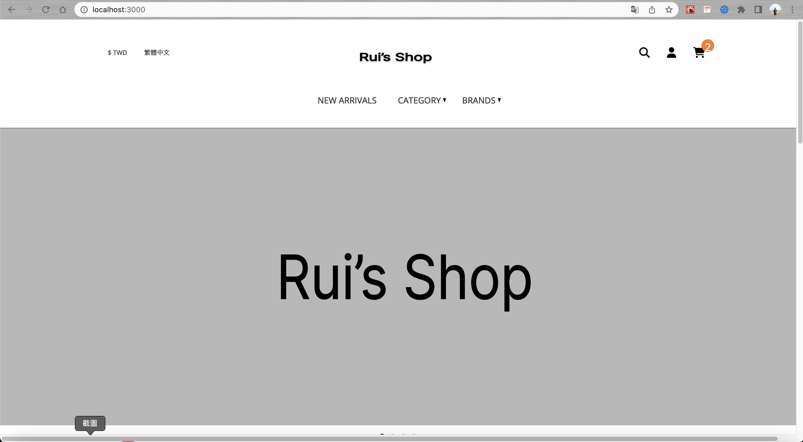
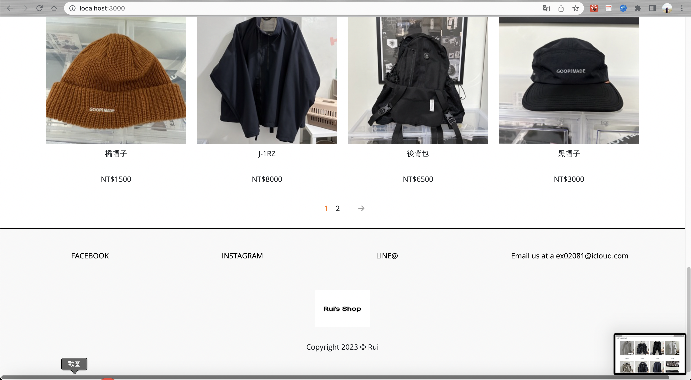
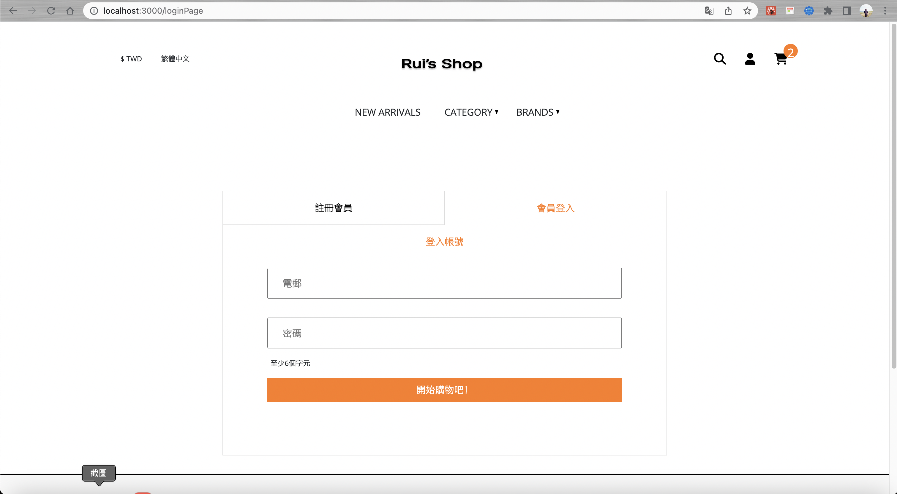
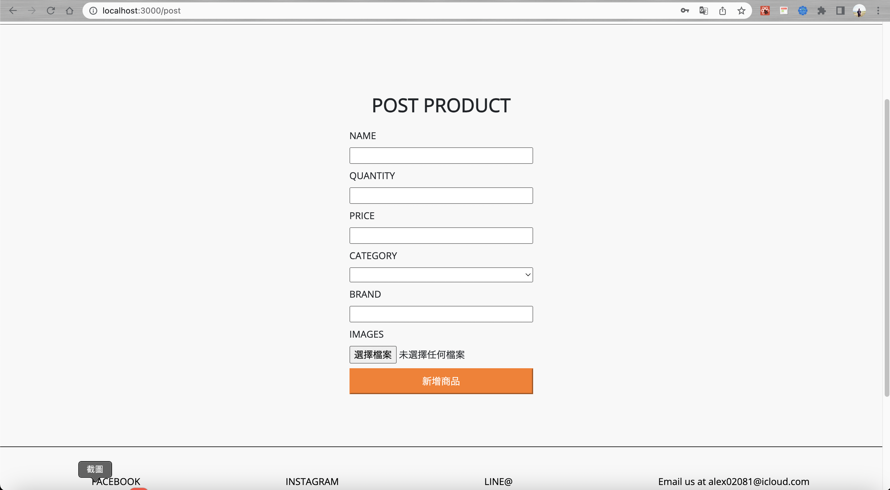
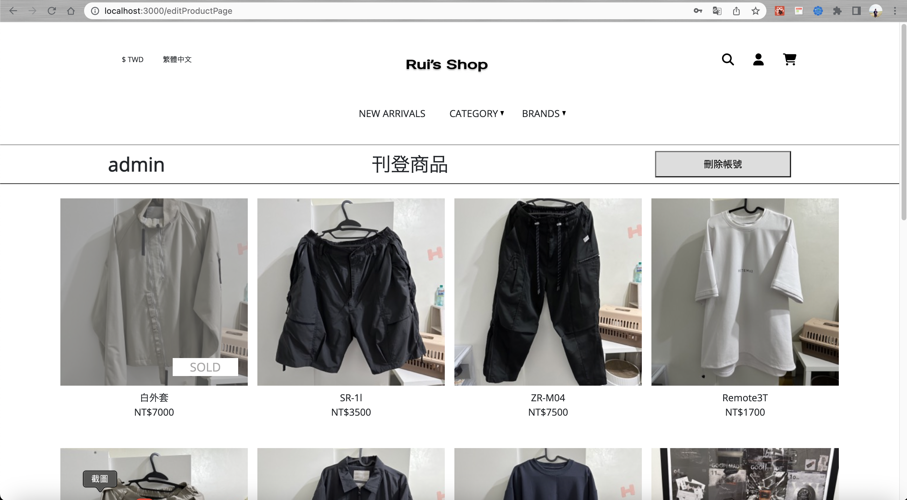
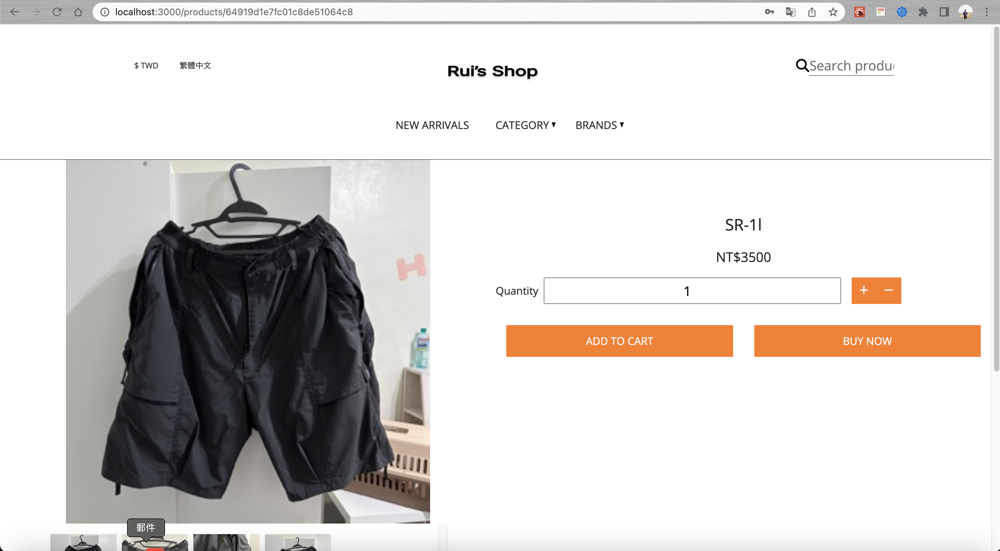
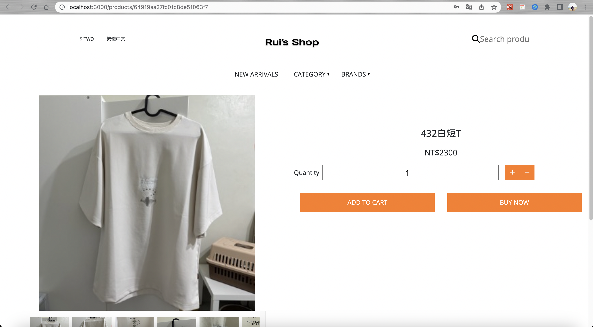

# GoopiWeb-Clone

# Project 介紹

此專案是以 Clone Goopi 網站作為基礎，平常就有在fb社團或旋轉拍賣會賣二手衣服，以此想法下去實作，實現電商網站基礎功能。

#

# Demo 影片

https://www.youtube.com/watch?v=VU70EFXNjqY

#

# 功能特色

前端用 React CSS 使用 Boostrap,SASS,RWD;

後端用 Node.js,Mongoose 架設，Joi 驗證資訊，Passport,Bcrypt 驗證加密

1.登入註冊功能皆有驗證

2.編輯個人資料、修改密碼

3.購物車，商品，綁定 User 中

4.可上架、編輯、刪除商品

5.商品分類，品牌分類

6.搜尋商品

7.商品分頁

8.側欄購物車

9.主頁大圖排序

#

# 待改善功能

1.圖片需事先在/public/images 中否則無法上傳

2.結帳邏輯

3.金流

#

# 預覽網頁圖片

#

# 資源

http://www.goopi.co/
